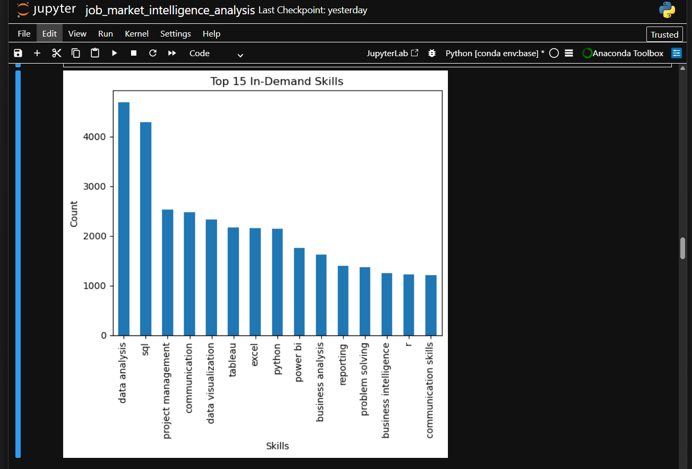
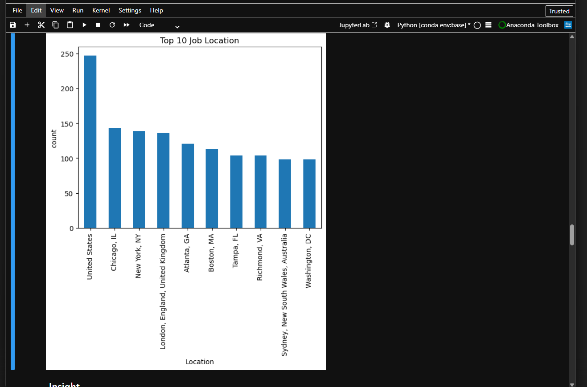
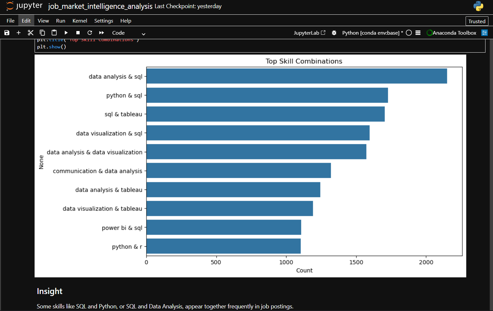

# Job Market Intelligence Analysis

## Overview
This project analyzes job market data to understand in-demand skills, hiring trends, and skill gaps for Data Analyst roles.

## Key Features
- Analyzed top in-demand skills like SQL, Python, and Excel
- Explored job locations and hiring trends
- Studied experience level distribution
- Performed Skill Gap Analysis
- Identified Skill Combinations used in real job postings

## Tools Used
- Python
- Pandas
- Matplotlib
- Seaborn

## Key Insights
- SQL and Python are the most demanded skills
- Most job roles require mid-level experience
- Beginners face a skill gap compared to industry requirements
- Companies prefer candidates with multiple skill combinations

## Conclusion
This project helps job seekers understand which skills to focus on and provides insights into current hiring trends in the data analytics field.

## Visualizations

### Skill Demand

### Job Locations

### Skill Combinations

